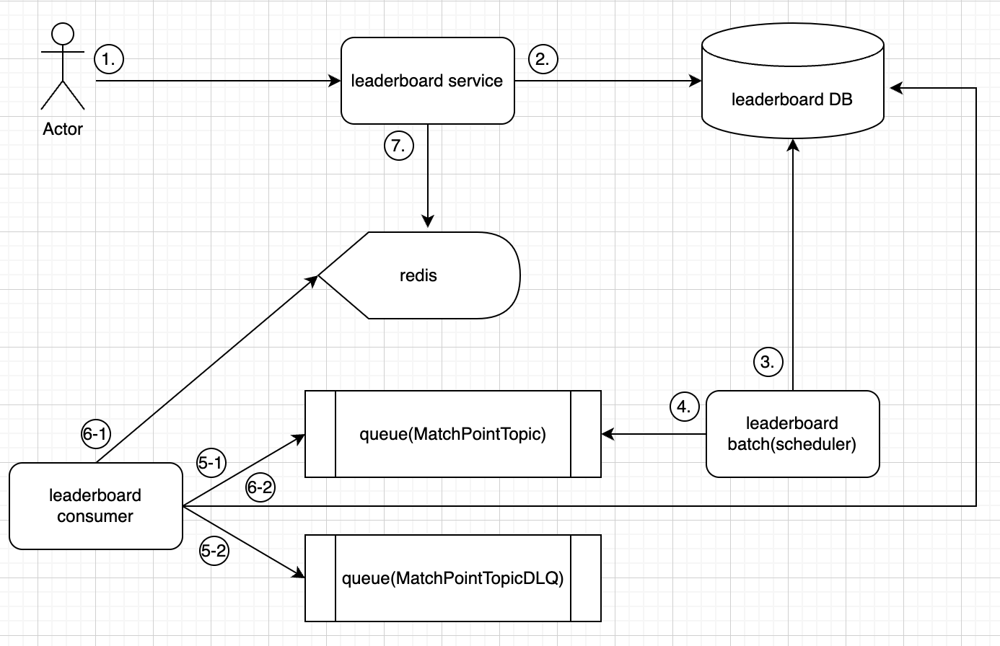

# Leaderboard

## 요약

- game leaderboard 아키텍처를 작성하고 기능 개발합니다.

## 요구사항

- 게임이 끝나고 player 들의 leaderboard를 구성해야 합니다.
- player가 하루동안 획득한 score를 기반으로 leaderboard를 구성해야 합니다.
- Season 별로 leaderboard를 구성해야 합니다.
- score는 게임에서 획득한 point를 기반으로 합니다.
- leaderboard에는 사용자 id, 점수, 순위가 노출 되어야 합니다.
- 사용자 id로 점수, 순위를 조회할 수 있어야 합니다.

- 리더보드는 총 3가지를 가집니다.
    - PostMatch Leaderboard -> game 직후 player 들의 leaderboard
    - Daily Leaderboard -> 하루동안 사용자의 leaderboard
    - Season Leaderboard -> season 별 leaderboard

## 아키텍처


## 설명

- 

## 사용기술

- library : spring boot, kotlin, jpa, redisson, kafka
- infra : mysql, redis, kafka

## Domain

## MatchUserPoint

| field      | type   | Description  | 
|------------|--------|--------------|
| user_id    | String | 사용자 id       |
| match_id   | String | game 대전 id   |
| point      | Number | 획득한 point    |
| pointed_at | Long   | point 획득한 시간 |
| created_at | Long   | 생성 시간        |

## DailyLeaderboard

| field      | type    | Description  | 
|------------|---------|--------------|
| date       | Instant | 일별           |
| user_id    | String  | 사용자 id       |
| point      | Number  | 획득한 point    |
| pointed_at | Long    | point 획득한 시간 |
| created_at | Long    | 생성 시간        |

## SeasonLeaderboard

| field        | type    | Description  | 
|--------------|---------|--------------|
| user_id      | String  | 사용자 id       |
| season       | String  | 시즌           |
| season_start | Instant | 시즌 시작        |
| season_end   | Instant | 시즌 종료        |
| point        | Number  | 획득한 point    |
| pointed_at   | Long    | point 획득한 시간 |
| created_at   | Long    | 생성 시간        |

## Api

- [POST] /v1/matches/{matchId}/users/{userId}/point
- [GET] /v1/matches/{matchId}/score
- [GET] /v1/daily-leaderboard/users/{userId}
- [GET] /v1/season-leaderboard/users/{userId}
- [GET] /v1/daily-leaderboard
- [GET] /v1/season-leaderboard

### [POST] /v1/matches/{matchId}/users/{userId}/point
#### description

- game match로 획득한 point를 적립한는 api

#### query

- none

#### request body

```json
{"point": 4}
```

#### response

- none

### [GET] /v1/matches/{matchId}/score
#### description

- match에 참여한 player 들의 랭킹을 조회 합니다.

#### query

- none

#### request body

- none

#### response

```json
{
  "matchId": "werwfasdfasdf",
  "user"
}
```


